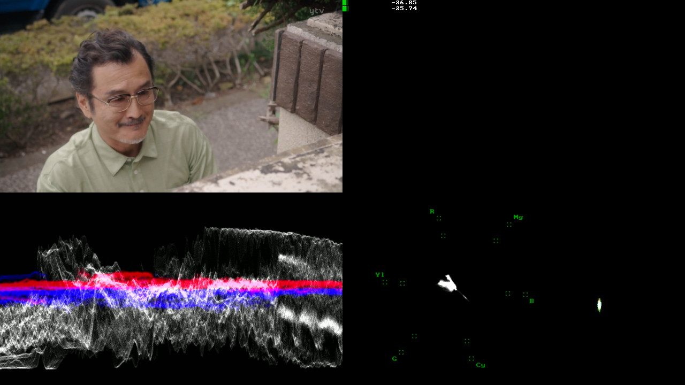
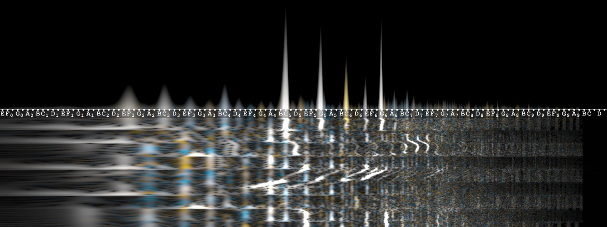
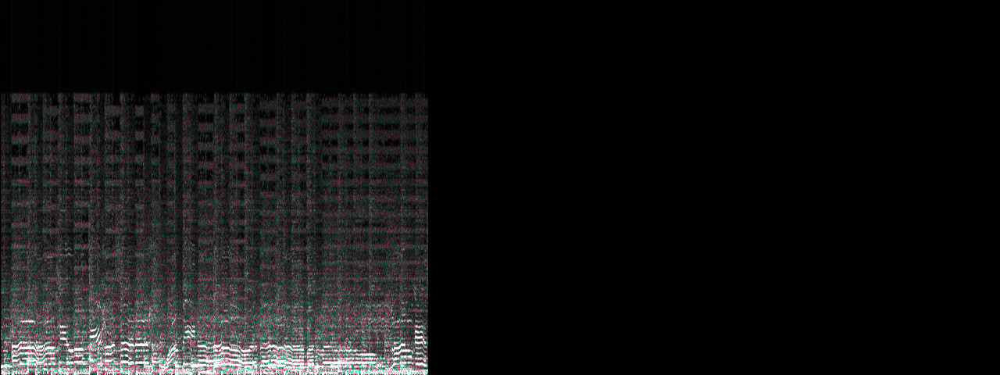
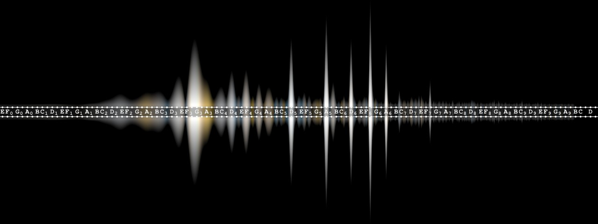
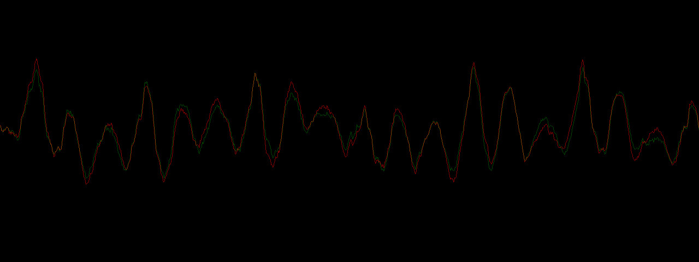

## Waveform Monitor LUA Script for MPV

- VideoTek.lua is a waveform monitor for MPV.
- visualizer.lua is a script that shows various audio visualization for MPV.

## Key bindings

Both filters are disabled by default.
 
Press "Y" to turn on "VideoTek" and have a waveform monitor for luma, chroma, phase and loudness.
 
Press "C" to turn on "Visualizer" and switch between showcqt, avectorscope, showspectrum, showcqtbar and showwaves.
 

## Screenshots

### VideoTek.lua

### visualizer.lua

- showcqt

- avectorscope

- showspectrum

- showcqtbar

- showwaves

### Contributors
- mfcc64 for the audio visualizers.
- Livio Aloja & Francesco Bucciantini for VideoTek.
